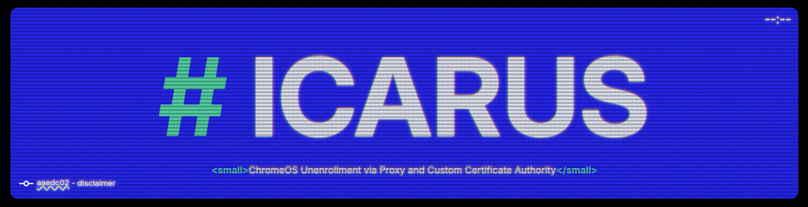

<a href="https://t3rm1n4l.dev">
  
</a>

<p align="center">
A guide, built with <a href="https://bun.sh/">Bun</a>, <a href="https://tailwindcss.com/">SCSS</a> and <a href="https://astro.build/">Astro</a>, and hosted on <a href="https://pages.github.com/">Github Pages</a>! ft. aesthetic, and a responsive, mobile-friendly design.
</p>

## Local Development

1. Clone the source code to your device

```sh
git clone https://github.com/T3M1N4L/icarus
```

2. Install the project's dependencies

```sh
bun install
```

3. Build the static site to `/dist`

```sh
bun run build
```

The final website is **static**, and as such, it can be built and deployed on any static site hosting service, such as GitHub Pages. This repository contains the full source code.

### Notes

- Root layout is in `/src/layout/main.astro` and specific pages `/src/pages/`.
- Global styles are located at `/src/global.scss`
- Run `bun run clean` clean to clean up files using prettier before commiting.
